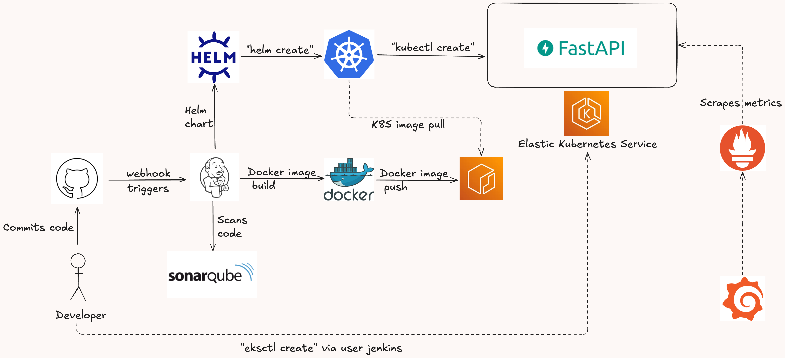
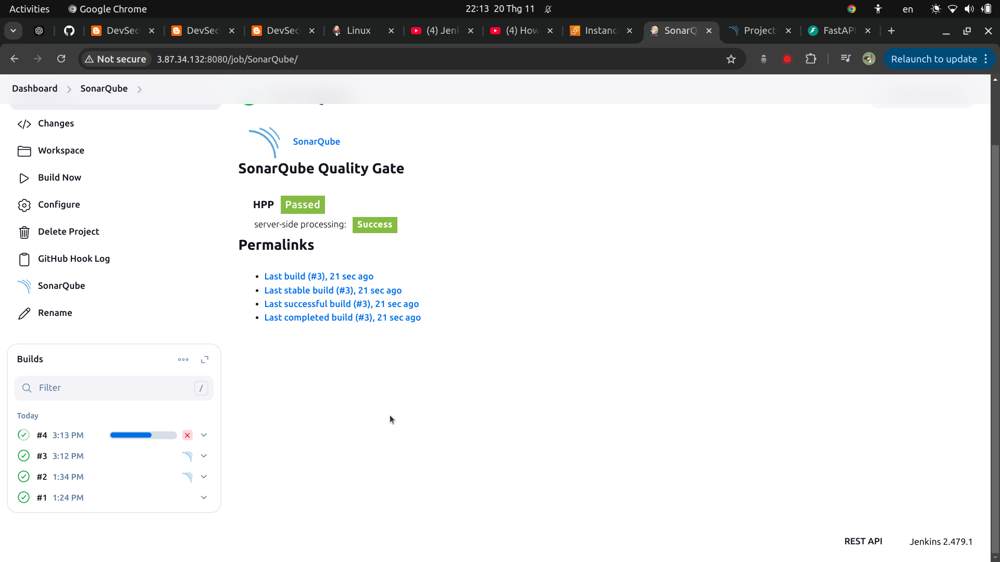

# README.md

<!-- @import "[TOC]" {cmd="toc" depthFrom=1 depthTo=6 orderedList=false} -->
<!-- code_chunk_output -->

* Contents:
    * [Introduction](#introduction)
    * [Pipeline Overview](#pipeline-overview)
    * [Repository Structure](#repository-structure)
    * [Setup Instructions](#setup-instructions)
    * [Results](#Results)
<!-- /code_chunk_output -->


## Introduction:
Using Jenkins to automate the process of building, testing and deploying a microservice application to AWS Elastic Kubernetes Service with SonarQube for the NT548.P11 course - Fall 2024 semester at University of Information Technology - VNUHCM.

## Pipeline Overview:
This is a simple project I created as a homework for my university course. This repo will help and guide you to build and serve ML model as in a production environment (AWS). I also used tool & technologies to quickly deploy the ML system into production and automate processes during the development and deployment of the ML system.



- Source control: Git/Github
- CI/CD: Jenkins
- Build API: FastAPI
- Containerize application: Docker, AWS Elastic Container Registry
- Container orchestration system: Kubernetes/K8S
- K8s's package manager: Helm
- Deliver infrastructure as code: Cloudformation (eksctl)
- Monitoring: Prometheus, Grafana
- Cloud platform: Amazon Web Services

## Repository Structure:
```txt
CI-CD-pipeline-with-Jenkins
  ├── app
  │   ├── main.py
  │   ├── schema.py
  │   └── utils
  │       ├── __init__.py
  │       ├── data_processing.py
  │       └── logging.py
  ├── assets
  ├── deployment-helmchart
  │   ├── .helmignore
  │   ├── Chart.yaml
  │   ├── templates
  │   │   ├── _helpers.tpl
  │   │   ├── deployment.yaml
  │   │   ├── hpa.yaml
  │   │   ├── ingress.yaml
  │   │   ├── NOTES.txt
  │   │   ├── service.yaml
  │   │   ├── serviceaccount.yaml
  │   │   └── tests
  │   │       └── test-connection.yaml
  │   └── values.yaml
  ├── Dockerfile
  ├── Jenkinsfile
  ├── models
  │   └── model.pkl
  ├── README.md
  ├── requirements.txt
  └── tests
      └── test_model_correctness.py


```

## Setup Instructions:
1. **Create EC2 instances on AWS Console:**
   - We need to create 2 EC2 instances: one for Jenkins and one for SonarQube.

   - Go to the EC2 section in AWS.
   

   - Click on ``Launch instances``.
   

   - The first EC2 instance is named ``Group12-Jenkins``.
   

   - The Jenkins EC2 uses Ubuntu 22.04.
   

   - We choose the instance type ``t2.small``.
   

   - Now create a key pair so that we can connect to the EC2 later.
   

   - Configure the storage with 25 GiB and create the instance.
   

   - Go to ``Security`` section in the Jenkins instance and click on the ``Security groups`` to edit it.
   

   - Add a rule with Port range 8080, so that we can access Jenkins on this EC2 using port 8080.
   

   - Now, the same as Jenkins EC2, we create a EC2 named as ``Group12-SonarQube``, with Ubuntu 22.04. The instance type is ``t2.medium`` to avoid some errors when setting up SonarQube. Also, add a new rule with port 9000 in `` Security group``.
   
   
   

2. **Set up Jenkins inside the Group12-Jenkins instance:**
   - To access the Group12-Jenkins instance via ssh key pair, first we copy its ``Public IPv4 address``.
   
   

   - Now from your local terminal, type the below command to set the permissions of the PEM key pair file to be readable only by the owner.
   
      ```bash
      chmod 400 your-key.pem
      ```
   
   - SSH into the Jenkins EC2 instance.
   
      ```bash
      ssh -i ~/.ssh/my-key.pem ubuntu@ip_address
      ```

   - Setting up the Jenkins EC2 instance:
   
   

      ```bash
      sudo apt update
      sudo hostnamectl set-hostname jenkins
      /bin/bash
      ```
   
   - Install OpenJDK 17.
   
      ```bash
      sudo apt install fontconfig openjdk-17-jre
      java -version
      ```

   - Install Jenkins.
      ```bash
      sudo wget -O /usr/share/keyrings/jenkins-keyring.asc \
      https://pkg.jenkins.io/debian-stable/jenkins.io-2023.key
      echo "deb [signed-by=/usr/share/keyrings/jenkins-keyring.asc]" \
      https://pkg.jenkins.io/debian-stable binary/ | sudo tee \
      /etc/apt/sources.list.d/jenkins.list > /dev/null
      sudo apt-get update
      sudo apt-get install jenkins
      ```

   - From your browser, access Jenkins using EC2_public_IPv4_address:8080. The password to log in can be found by ``sudo cat /var/lib/jenkins/secrets/initialAdminPassword``.
   

   - Click on ``Install suggested plugins``.
   

   - Click on ``Skip and continue as admin``.
   

   - Create a ``Freestyle project`` named as ``SonarQube``.
   

   - From the new project ``SonarQube`` in Jenkins, click on ``Configuration`` to set up the connection of the project in Jenkins to our Github repository.
   
   
   

   - To setup the connection to the SonarQube project in Jenkins, we need to create a webhook in the repository settings.
   
   
   
   Copy the URL of Jenkins then add ``/github-webhook/`` and paste into ``Payload URL``.
   
   Click on ``Let me select individual events`` and choose ``Pushes`` and ``Pull requests``.
   
   Now we can see the Webhook.
   

   - From Jenkins website, go to ``SonarQube`` project and click build now to test the connection to Github.
   
   
   

3. **Setting up SonarQube inside the Group12-SonarQube instance:**
   - SSH to the Group12-SonarQube EC2 instance using the same way as the Group12-Jenkins EC2 instance.

   - Install OpenJDK 17 and SonarQube.
      ```bash
      sudo apt install openjdk-17-jre
      sudo wget https://binaries.sonarsource.com/Distribution/sonarqube/sonarqube-9.9.2.77730.zip
      ```
      Then unzip the file and locate to the ``~/linux-x86-64`` folder to install the corresponding version.
      
      
   
   - SonarQube is installed and ready to be accessed.
   

   - Access SonarQube via URL ``Group12-SonarQube_EC2_publicIP:9000`` and login, the user name and password is both ``admin``.
   
   
   

   - Create your project ``Manually``.
   
   
   Integrate the project with Jenkins.
   
   Select Devops platform: Github.
   
   In the ``Create a jenkinsfile`` section, click ``Other`` and copy the code for later use, then click ``Finish this tutorial``.
    
    

   - On the right corner, click on the ``A`` button to access ``My account`` section.
    
   Click on ``Security``.
    
   Create a new token and copy it for later use.
    

   - Access the Jenkins website, we will integrate our pipeline with SonarQube.
   Click on ``Manage Jenkins``.
    
   Click on ``Plugins``.
    
   Install ``SSH2 Easy`` and ``SonarQube Scanner``.
    
   Configure ``Tools``.
    
   Add SonarQube Scanner
    
   Go to ``System``.
    
   Add SonarQube installations. The ``Server URL`` is the URL of SonarQube, ``Server authentication token`` is the token created in SonarQube.
    
    
    

   - Go back to the SonarQube project in Jenkins, configure the ``Build steps`` section and try building the pipeline to see how SonarQube works.
    
    
   Paste the code copied when creeating SonarQube project in the SonarQube website.
   
   Then ``save``.
   
   Build the project again.
   
   The repository passed the SonarQube scanning.
   
   

4. **Set up automated Jenkins pipeline for building and deploying FastAPI service to AWS EKS:**
   - We need to install some pre-requisites in the ``Group12-Jenkins`` EC2 instance:
      - Install AWS CLI:
      ```bash
      curl "https://awscli.amazonaws.com/awscli-exe-linux-x86_64.zip" -o "awscliv2.zip" 

      sudo apt install unzip

      sudo unzip awscliv2.zip  

      sudo ./aws/install
      ```
      - Install Helm:
      ```bash
      curl -fsSL -o get_helm.sh https://raw.githubusercontent.com/helm/helm/master/scripts/get-helm-3

      sudo chmod 700 get_helm.sh

      sudo ./get_helm.sh
      ```

      - Install eksctl:
       ```bash
      curl --silent --location "https://github.com/weaveworks/eksctl/releases/latest/download/eksctl_$(uname -s)_amd64.tar.gz" | tar xz -C /tmp

      sudo mv /tmp/eksctl /usr/local/bin
      ```

      - Install Docker:
      ```bash
      # Add Docker's official GPG key:
      sudo apt-get update
      sudo apt-get install ca-certificates curl
      sudo install -m 0755 -d /etc/apt/keyrings
      sudo curl -fsSL https://download.docker.com/linux/ubuntu/gpg -o /etc/apt/keyrings/docker.asc
      sudo chmod a+r /etc/apt/keyrings/docker.asc

      # Add the repository to Apt sources:
      echo \
      "deb [arch=$(dpkg --print-architecture) signed-by=/etc/apt/keyrings/docker.asc] https://download.docker.com/linux/ubuntu \
      $(. /etc/os-release && echo "$VERSION_CODENAME") stable" | \
      sudo tee /etc/apt/sources.list.d/docker.list > /dev/null
      sudo apt-get update
      ```
      ```bash
      sudo apt-get install docker-ce docker-ce-cli containerd.io docker-buildx-plugin docker-compose-plugin
      ```
      ```bash
      sudo groupadd docker

      sudo usermod -aG docker $USER

      newgrp docker
      ```

      - Install Kubectl:
      ```bash
      curl -LO "https://dl.k8s.io/release/$(curl -L -s https://dl.k8s.io/release/stable.txt)/bin/linux/amd64/kubectl"

      sudo install -o root -g root -m 0755 kubectl /usr/local/bin/kubectl
      ```

      - Jenkins must have proper permission to perform Docker builds:
      ```bash
      sudo usermod -a -G docker jenkins

      sudo service jenkins restart

      sudo systemctl daemon-reload

      sudo service docker stop
      sudo service docker start
      ```
      After doing this, Jenkins will restart, and you must login again using the same password to login into Jenkins at the beginning.

      - Install ``Docker`` and ``Docker pipeline`` plug ins in ``Manage Jenkins`` section.
      

      - Go to ``Elastic Container Registry`` in AWS Console and ``Create a repository``.
      
      Name the repository and click ``Create``.
      

   - The ``Group12-Jenkins`` EC2 instance must have the permission to create a cluster. We will create IAM Role with Administrator Access.
      - From ``Group12-Jenkins``, click on ``Security``, then ``Modify IAM role``.
      

      - Click on ``Create new IAM role``
      

      - Create a role with ``Administrator Access``.
      
      
      

      - Update IAM role:
      

   - Switch to Jenkins user and create the cluster with 1 node.
      ```bash
      sudo su - jenkins
      ```
      ```bash
      eksctl create cluster --name Group12-eks --region us-east-1 --nodegroup-name my-nodes-g12 --node-type t3.small --managed --nodes 1
      ```
      

   - After the cluster is created, create namespace ``model-serving``.
   

   - We need to make some changes to the Jenkinsfile so that later the pipeline can run properly.
      - Go to ``Amazon ECR`` to see our repository here. First copy its URI.
      

      - Paste it in the ``environment`` section in the Jenkinsfile.
      
      Also paste it in the ``values.yaml`` file in ``depolyment-helmchart``.
      

      - Go back to AWS Console, click on the repository and then click on ``View push commands``.
      

      - The first command is used for authentication purpose, the forth command is used for pushing images to our ECR. Copy both and paste them in the Jenkinsfile.
      
      
      

   
   - Go back to Jenkins website, now we create a new item, this time is a pipeline named ``myHelmK8SDeploymentJob``.
   
   
   - To setup this pipeline, go to ``Configuration``, we will link our github repository with this pipeline (for automated building and deploying pipeline).
      - Config ``Build Triggers``:
      

      - Head to the ``Pipeline`` section, click on ``Pipeline script from SCM``, then paste our repository URL in.
      
      

5. **Set up monitoring services:**

   - From terminal, type the following commands to setup Prometheus, Grafana on our cluster:
      ```bash
      helm repo add prometheus-community https://prometheus-community.github.io/helm-charts
      helm repo update
      helm upgrade --install stable prometheus-community/kube-prometheus-stack --namespace monitoring --create-namespace
      ```

   - Then, to expose Prometheus and Grafana to the external world, change the type from ``ClusterIP`` to ``LoadBalancer``.
   
   
   - Now we can access Prometheus and Grafana via external IP.
   
   Print the password of Grafana to access it.
   
   
   Login to Grafana.
   

   - Now we can import dashboards to Grafana, the datasource is Prometheus.
   
   Default data source: Prometheus.
   
   Import dashboard number ``15760``: Kubernetes/Views/Pods
   
   Enjoy the dashboards!
   
   


## Results:
- After completed the setup stage, when we make some changes to the repository, both two pipeline, one is the deployment, one is SonarQube, will triggers.

- Logs of Jenkins when the pipeline triggers:


- From terminal, we can find the URL to access the service using the command:
   ```bash
   kubectl get svc -n model-serving
   ```
   

- Access the FastAPI service using the above URL with ``/docs``.

Try it out!


- We can also see that SonarQube will scan the repository every time we make changes.


